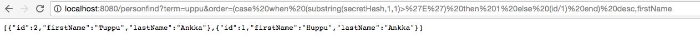
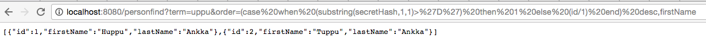

PoC for SQL injection bug found in Solita Webhack 2016.

Founders: Niklas Särökaari, Joona Immonen
Analysis: Arto Santala, Niklas Särökaari, Joona Immonen, Antti Virtanen, Michael Holopainen
PoC: Antti Ahola, Antti Virtanen

## The problem briefly

Spring data relies on helper class QueryUtils, which does the following:

```
QueryUtils.applySorting("select person from Person person", new Sort("firstName"))
```

Effectively this doesn't validate or escape the string inside Sort properly. This method is not normally
accessed directly by application developers as creating raw queries with plain strings is not a good practice, but
relatively innocent code can inadvertently contain SQL injection because of this. The PoC demonsrates how this
might realistically happen (and did happen).

## How to exploit?

Exploiting is not as straightforward as it would seem, because it depends on multiple factors. The query is not a raw SQL query and tricks like "union all select * from .." may not work. It might be a JPQL-query or HQL query, but still exploitable.

### A short example:

The search term selects only two records from the database. Ordering by *firstName* yields Huppu,Tuppu. 

The content of a secret hash can be deduced by playing with the order parameter. 





